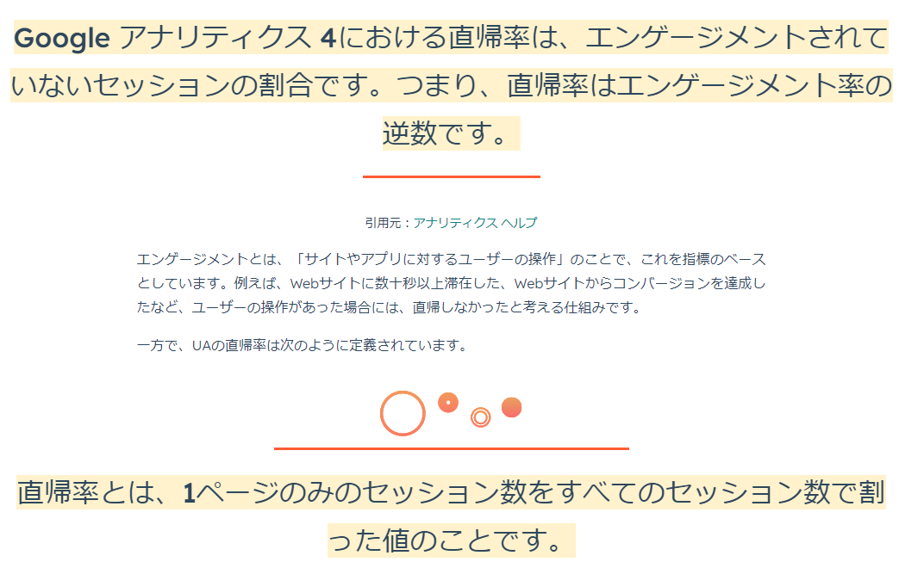
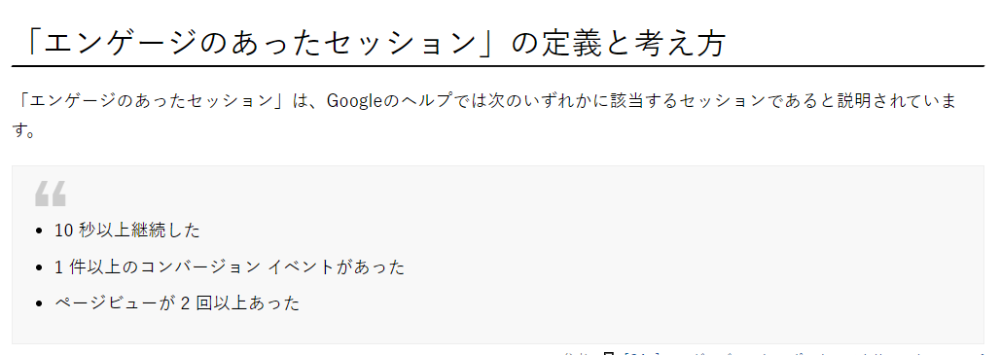

# GA4 参照元/メディアについて

## GA4とUAの違い
- 分析の主軸が「セッション」から「ユーザー」へと変化した
- 従来のUAのように、異なる端末ごとに計測を行っていては、各ユーザーの正確な行動をデータとして取得できない
- GA4では、異なる端末からのアクセスでも同一ユーザーだと判別できる、新しいユーザー行動に対応した仕組み
- [参考](https://blog.hubspot.jp/ga4-ua)

## 探索とレポートの違い
- ユーザー数やコンバージョン数などサイトの状況を大まかに把握したい時には「レポート」を、より詳細に分析したい時には「探索レポート」を、というように使い分けます。
- [参考](https://find-a.jp/seotimes/ga4_custom_report/)

## UA ⇒ GA4 対応
|  UA  |  GA4  |
| ---- | ---- |
|  参照元/メディア  |  セッションの参照元/メディア  |
|  セッション  |  セッション  |
|  新規セッション率  |  新規ユーザー数 / 総ユーザー数  |
|  新規ユーザー  |  新規ユーザー数  |
|  直帰率  |  直帰率  |
|  ページ/セッション  |  表示回数 / セッション  |
|  平均セッション時間  |  セッションあたりの平均エンゲージメント時間  |
|  eコマースのコンバージョン率  |  トランザクション / セッション  |
|  トランザクション数  |  トランザクション  |
|  収益  |  eコマースの収益  |

## 参照元/メディアの違い
- アトリビューションの中の"参照元/メディア"：
    - アトリビューションは、コンバージョンに至るまでのユーザーの行動を追跡し、どのマーケティング施策が効果的であるかを評価するためのものです。アトリビューションの中の"参照元/メディア"は、コンバージョンにつながるセッションのうち、特定のマーケティング施策によってもたらされたものを特定します。
- トラフィックソースの中の"セッションの参照元/メディア"：
    - トラフィックソースは、あるウェブサイトやアプリケーションへの訪問者がどこから来たかを特定する情報です。"セッションの参照元/メディア"は、各セッションごとの参照元とメディアを特定します。例えば、ユーザーが検索エンジンから来た場合や、SNSからのリンクをクリックした場合などです。
- トラフィックソースの中の"ユーザー最初の参照元/メディア"：
    - "ユーザー最初の参照元/メディア"は、ユーザーが初めてウェブサイトやアプリケーションにアクセスした際の参照元とメディアを特定します。これは、ユーザーが初めてウェブサイトやアプリケーションに訪れた経路を把握するために使用されます。

## 直帰率の定義

## セグメントの違い
- 「ユーザーセグメント」「セッションセグメント」「イベントセグメント」がある
- 「ユーザーセグメント」
    - 該当イベントが発生した訪問者（ユーザー）すべてのデータ
- 「セッションセグメント」
    - 該当イベントが発生した訪問（セッション）すべてのデータ
- 「イベントセグメント」
    - 該当するイベントのみ
- [参考](https://www.pc-koubou.jp/magazine/62316#section02:~:text=%E8%AA%AC%E6%98%8E%E3%81%97%E3%81%BE%E3%81%99%EF%BC%89%E3%80%82-,3%E7%A8%AE%E9%A1%9E%E3%81%AE%E3%82%BB%E3%82%B0%E3%83%A1%E3%83%B3%E3%83%88%E3%81%AE%E9%81%95%E3%81%84,-%E3%80%8C%E3%82%AB%E3%82%B9%E3%82%BF%E3%83%A0%20%E3%82%BB%E3%82%B0%E3%83%A1%E3%83%B3%E3%83%88%E3%82%92)

## その他
- [デモアカウント](https://support.google.com/analytics/answer/6367342?hl=ja#zippy=%2C%E3%81%93%E3%81%AE%E8%A8%98%E4%BA%8B%E3%81%AE%E5%86%85%E5%AE%B9:~:text=Google%20%E3%82%A2%E3%83%8A%E3%83%AA%E3%83%86%E3%82%A3%E3%82%AF%E3%82%B9%204%20%E3%83%97%E3%83%AD%E3%83%91%E3%83%86%E3%82%A3%3A%20Google%20Merchandise%20Store%EF%BC%88%E3%82%A6%E3%82%A7%E3%83%96%E3%83%87%E3%83%BC%E3%82%BF%EF%BC%89) 
